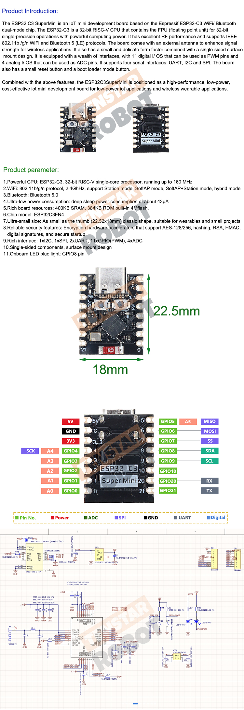

# Scrolling text display using the MAX7219 LED driver on a ESP32-C3

This is a simple example of how to use the MAX7219 LED driver with the ESP32-C3. The MAX7219 is a 8-digit LED display driver, which can be used to drive a 8x8 LED matrix or a 7-segment LED display. 

The driver is connected to the ESP32-C3 using the SPI interface.

It uses the esp-idf & arduino libraries on PlatformIO.

## Hardware
ESP32 C3 SuperMini

